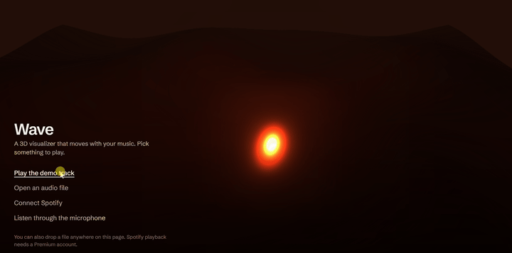

# Wave

Inspired by the Playstation 3 audio visualizer I built a real-time 3D audio visualizer that runs in the browser. A glossy, rippling surface reacts to the music: bass lifts canyon walls along the sides, mids and treble add ripples, and beats flash the lighting. The camera eases between three scenes every 15 seconds.

**Live:** https://wavevisualizer.com

<!-- Add a short screen recording here:  -->

## Ways to play

- **Demo track.** An original loop generated in your browser with the Web Audio API, so it works right away with no file and no account.
- **Your own file.** Open or drag in an audio file (MP3, WAV, M4A, OGG, FLAC…).
- **Spotify.** Sign in and search for songs to play them in the page with the Web Playback SDK (Spotify Premium is required). The SDK doesn't expose the raw audio, so **Sync visuals to audio** shares the tab's sound with the analyser (desktop) or listens through the mic (phones).
- **Microphone.** Visualize whatever is playing nearby.

You can also paste lyrics for any track. Plain text shows as a panel; `.lrc` lines like `[00:12.30] first line` highlight in time with the song. Lyrics are stored in your browser only.

## How it works

```
 file / demo ──► <audio> ──┬──────────────► speakers
                           └─► AnalyserNode ──► visualizer (every frame)
 tab audio / mic ───────────► AnalyserNode      (analysis only, never played back)
```

1. **Analysis.** Every source feeds one `AnalyserNode` (1024-point FFT). Each frame the spectrum is split into bass (0–8% of bins), mids (8–40%) and treble (40–100%), and each band is smoothed so the motion doesn't jitter.
2. **Beat detection.** A beat is any frame where bass jumps 35% above its slow running average, limited to about three per second.
3. **Geometry.** A 120×120-segment plane is displaced on the CPU every frame: two rolling sine waves for the base surface, side walls scaled by bass, and finer ripples scaled by mids and treble. Normals are recomputed so the lighting follows the waves.
4. **Rendering.** Three.js with a metallic `MeshStandardMaterial`, a point light whose color and intensity follow the music, exponential fog, and an `UnrealBloomPass` whose strength rises with the bass.
5. **Spotify sign-in** uses the OAuth Authorization Code flow with PKCE, so no client secret is shipped in the page.

## Code layout

| File | What it does |
| --- | --- |
| `js/main.js` | Wires up the UI and switches between start screen, file player, Spotify and mic modes |
| `js/audio.js` | Audio graph: file playback, tab-audio and mic capture, the shared analyser |
| `js/visualizer.js` | Three.js scene, camera scenes, audio-reactive displacement and bloom |
| `js/demo.js` | Generates the demo loop with an `OfflineAudioContext` and encodes it as WAV |
| `js/spotify.js` | PKCE sign-in, token refresh, Web Playback SDK, search |
| `js/pkce.js` | PKCE helpers (verifier, SHA-256 challenge, base64url) |
| `js/lyrics.js`, `js/lyrics-parser.js` | Lyrics editor and overlay; `.lrc` parsing and line lookup |
| `tests/core.test.js` | Unit tests for the lyrics parser and PKCE helpers |

No build step and no framework: plain ES modules served as static files.

## Running locally

```bash
python3 -m http.server 8000   # ES modules need to be served over http, not opened as a file
# open http://localhost:8000
npm test                      # runs the unit tests with Node's built-in test runner
```

Spotify sign-in only works on a redirect URI registered in the Spotify app's dashboard.

## Deploying

The site is static and deploys to Cloudflare Workers as static assets (`wrangler.jsonc`). `.assetsignore` keeps the tests and docs out of the deployed site.

## Known limits

- The Spotify app is in Spotify's development mode, which only allows accounts that have been added to it. Everything else works without signing in.
- Geometry is displaced on the CPU. Moving that into a vertex shader would allow a much denser mesh.

## Tech

JavaScript (ES modules), Three.js, Web Audio API, Spotify Web API and Web Playback SDK, OAuth 2.0 with PKCE, Cloudflare Workers.
